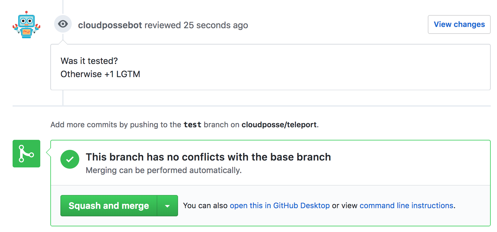

# github-commenter [](https://travis-ci.org/cloudposse/github-commenter)

## Introduction

Command line utility for creating GitHub comments on Commits, Pull Request Reviews or Issues.

* https://developer.github.com/v3/repos/comments/#create-a-commit-comment
* https://developer.github.com/v3/pulls/reviews/#create-a-pull-request-review
* https://developer.github.com/v3/issues/comments/#create-a-comment





## Usage

__NOTE__: Create a [GitHub token](https://help.github.com/articles/creating-an-access-token-for-command-line-use) with `repo:status` and `public_repo` scopes

__NOTE__: The module accepts parameters as command-line arguments or as ENV variables (or any combination of command-line arguments and ENV vars).
Command-line arguments take precedence over ENV vars


| Command-line argument |  ENV var                 |  Description                                                                                                               |
|:----------------------|:-------------------------|:---------------------------------------------------------------------------------------------------------------------------|
| token                 | GITHUB_TOKEN             | Github access [token](https://help.github.com/articles/creating-an-access-token-for-command-line-use)                      |
| owner                 | GITHUB_OWNER             | Github repository owner (_e.g._ `cloudposse`                                                                               |
| repo                  | GITHUB_REPO              | Github repository name (_e.g._ `github-commenter`                                                                          |
| type                  | GITHUB_COMMENT_TYPE      | Comment type: `commit`, `pr` or `issue`                                                                                    |
| sha                   | GITHUB_COMMIT_SHA        | Commit SHA. Required when `type=commit`                                                                                    |
| number                | GITHUB_PR_ISSUE_NUMBER   | Pull Request or Issue number. Required when `type=pr` or `type=issue`                                                      |
| format                | GITHUB_COMMENT_FORMAT    | Comment format (optional). Supports `Go` [templates](https://golang.org/pkg/text/template): `My comment:<br>{{.}}`         |
| comment               | GITHUB_COMMENT           | Comment text. If neither `comment` nor `GITHUB_COMMENT` provided, will read from `stdin`                                   |


__NOTE__: The module accepts the text of the comment from the command-line argument `comment`, from the ENV variable `GITHUB_COMMENT`, or from the standard input.
Command-line argument takes precedence over ENV var, and ENV var takes precedence over standard input.
Accepting comments from `stdin` allows using Unix pipes to send the output from another program as the input to the module

```sh
    cat comment.txt | github-commenter ...
```

```sh
    terraform plan 2>&1 | github-commenter -format "Output from `terraform plan`<br>```{{.}}```"
```


## Examples

The module can be called directly or as a Docker container.


### build the Go program locally

```sh
go get

CGO_ENABLED=0 go build -v -o "./dist/bin/github-commenter" *.go
```


### run locally with ENV vars
[run_locally_with_env_vars.sh](examples/run_locally_with_env_vars.sh)

```sh
export GITHUB_TOKEN=XXXXXXXXXXXXXXXX
export GITHUB_OWNER=cloudposse
export GITHUB_REPO=github-commenter
export GITHUB_COMMENT_TYPE=pr
export GITHUB_PR_ISSUE_NUMBER=1
export GITHUB_COMMENT_FORMAT="My comment:<br>{{.}}"
export GITHUB_COMMENT="+1 LGTM"

./dist/bin/github-commenter
```


### run locally with command-line arguments
[run_locally_with_command_line_args.sh](examples/run_locally_with_command_line_args.sh)

```sh
./dist/bin/github-commenter \
        -token XXXXXXXXXXXXXXXX \
        -owner cloudposse \
        -repo github-commenter \
        -type pr \
        -number 1 \
        -format "My comment:<br>{{.}}" \
        -comment "+1 LGTM"
```


### build the Docker image
__NOTE__: it will download all `Go` dependencies and then build the program inside the container (see [`Dockerfile`](Dockerfile))


```sh
docker build --tag github-commenter  --no-cache=true .
```


### run in a Docker container with ENV vars
[run_docker_with_env_vars.sh](examples/run_docker_with_env_vars.sh)

```sh
docker run -i --rm \
        -e GITHUB_TOKEN=XXXXXXXXXXXXXXXX \
        -e GITHUB_OWNER=cloudposse \
        -e GITHUB_REPO=github-commenter \
        -e GITHUB_COMMENT_TYPE=pr \
        -e GITHUB_PR_ISSUE_NUMBER=1 \
        -e GITHUB_COMMENT_FORMAT="My comment:<br>{{.}}" \
        -e GITHUB_COMMENT="+1 LGTM" \
        github-commenter
```


### run in a Docker container with local ENV vars propagated into the container's environment
[run_docker_with_local_env_vars.sh](examples/run_docker_with_local_env_vars.sh)

```sh
export GITHUB_TOKEN=XXXXXXXXXXXXXXXX
export GITHUB_OWNER=cloudposse
export GITHUB_REPO=github-commenter
export GITHUB_COMMENT_TYPE=pr
export GITHUB_PR_ISSUE_NUMBER=1
export GITHUB_COMMENT_FORMAT="My comment:<br>{{.}}"
export GITHUB_COMMENT="+1 LGTM"

docker run -i --rm \
        -e GITHUB_TOKEN \
        -e GITHUB_OWNER \
        -e GITHUB_REPO \
        -e GITHUB_COMMENT_TYPE \
        -e GITHUB_PR_ISSUE_NUMBER \
        -e GITHUB_COMMENT_FORMAT \
        -e GITHUB_COMMENT \
        github-commenter
```


### run in a Docker container with ENV vars declared in a file
[run_docker_with_env_vars_file.sh](examples/run_docker_with_env_vars_file.sh)

```sh
docker run -i --rm --env-file ./example.env github-commenter
```


## Help

**Got a question?**

File a GitHub [issue](https://github.com/cloudposse/github-commenter/issues), send us an [email](mailto:hello@cloudposse.com) or reach out to us on [Gitter](https://gitter.im/cloudposse/).


## Contributing

### Bug Reports & Feature Requests

Please use the [issue tracker](https://github.com/cloudposse/github-commenter/issues) to report any bugs or file feature requests.

### Developing

If you are interested in being a contributor and want to get involved in developing `github-commenter`, we would love to hear from you! Shoot us an [email](mailto:hello@cloudposse.com).

In general, PRs are welcome. We follow the typical "fork-and-pull" Git workflow.

 1. **Fork** the repo on GitHub
 2. **Clone** the project to your own machine
 3. **Commit** changes to your own branch
 4. **Push** your work back up to your fork
 5. Submit a **Pull request** so that we can review your changes

**NOTE:** Be sure to merge the latest from "upstream" before making a pull request!


## License

[APACHE 2.0](LICENSE) © 2018 [Cloud Posse, LLC](https://cloudposse.com)

See [LICENSE](LICENSE) for full details.

    Licensed to the Apache Software Foundation (ASF) under one
    or more contributor license agreements.  See the NOTICE file
    distributed with this work for additional information
    regarding copyright ownership.  The ASF licenses this file
    to you under the Apache License, Version 2.0 (the
    "License"); you may not use this file except in compliance
    with the License.  You may obtain a copy of the License at

      http://www.apache.org/licenses/LICENSE-2.0

    Unless required by applicable law or agreed to in writing,
    software distributed under the License is distributed on an
    "AS IS" BASIS, WITHOUT WARRANTIES OR CONDITIONS OF ANY
    KIND, either express or implied.  See the License for the
    specific language governing permissions and limitations
    under the License.


## About

`github-commenter` is maintained and funded by [Cloud Posse, LLC][website].


Like it? Please let us know at <hello@cloudposse.com>

We love [Open Source Software](https://github.com/cloudposse/)!

See [our other projects][community]
or [hire us][hire] to help build your next cloud platform.

  [website]: https://cloudposse.com/
  [community]: https://github.com/cloudposse/
  [hire]: https://cloudposse.com/contact/


### Contributors

| [![Erik Osterman][erik_img]][erik_web]<br/>[Erik Osterman][erik_web] | [![Andriy Knysh][andriy_img]][andriy_web]<br/>[Andriy Knysh][andriy_web] |
|-------------------------------------------------------|------------------------------------------------------------------|

  [erik_img]: http://s.gravatar.com/avatar/88c480d4f73b813904e00a5695a454cb?s=144
  [erik_web]: https://github.com/osterman/
  [andriy_img]: https://avatars0.githubusercontent.com/u/7356997?v=4&u=ed9ce1c9151d552d985bdf5546772e14ef7ab617&s=144
  [andriy_web]: https://github.com/aknysh/
