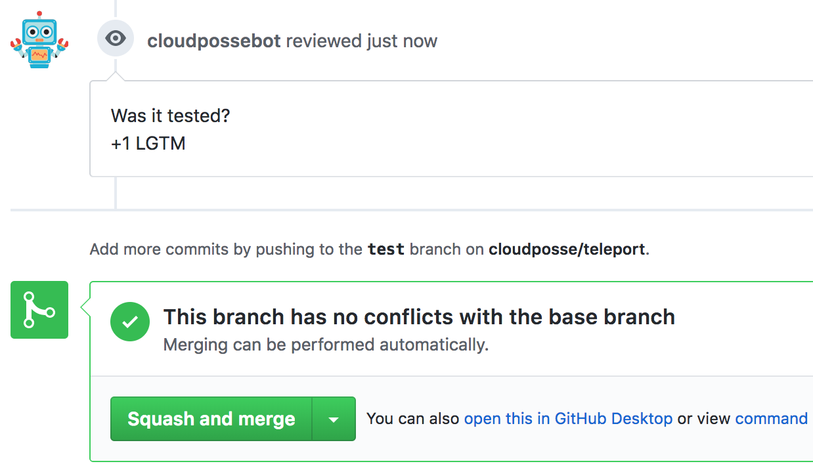

<!-- This file was automatically generated by the `build-harness`. Make all changes to `README.yaml` and run `make readme` to rebuild this file. -->

[](https://cloudposse.com)

# github-commenter [](https://travis-ci.org/cloudposse/github-commenter) [](https://travis-ci.org/cloudposse/github-commenter/releases) [](https://slack.cloudposse.com)


Command line utility for creating GitHub comments on Commits, Pull Request Reviews or Issues.

* <https://developer.github.com/v3/repos/comments/#create-a-commit-comment>
* <https://developer.github.com/v3/pulls/reviews/#create-a-pull-request-review>
* <https://developer.github.com/v3/issues/comments/#create-a-comment>


---

This project is part of our comprehensive ["SweetOps"](https://docs.cloudposse.com) approach towards DevOps. 


It's 100% Open Source and licensed under the [APACHE2](LICENSE).


## Screenshots



*GitHub PR Review Comment*


## Usage

__NOTE__: Create a [GitHub token](https://help.github.com/articles/creating-an-access-token-for-command-line-use) with `repo:status` and `public_repo` scopes

__NOTE__: The module accepts parameters as command-line arguments or as ENV variables (or any combination of command-line arguments and ENV vars).
Command-line arguments take precedence over ENV vars


| Command-line argument |  ENV var                 |  Description                                                                                                               |
|:----------------------|:-------------------------|:---------------------------------------------------------------------------------------------------------------------------|
| token                 | GITHUB_TOKEN             | Github access [token](https://help.github.com/articles/creating-an-access-token-for-command-line-use)                      |
| owner                 | GITHUB_OWNER             | Github repository owner (_e.g._ `cloudposse`)                                                                              |
| repo                  | GITHUB_REPO              | Github repository name (_e.g._ `github-commenter`)                                                                         |
| type                  | GITHUB_COMMENT_TYPE      | Comment type: `commit`, `pr` or `issue`                                                                                    |
| sha                   | GITHUB_COMMIT_SHA        | Commit SHA. Required when `type=commit`                                                                                    |
| number                | GITHUB_PR_ISSUE_NUMBER   | Pull Request or Issue number. Required when `type=pr` or `type=issue`                                                      |
| format                | GITHUB_COMMENT_FORMAT    | Comment format (optional). Supports `Go` [templates](https://golang.org/pkg/text/template): `My comment:<br/>{{.}}`         |
| comment               | GITHUB_COMMENT           | Comment text. If neither `comment` nor `GITHUB_COMMENT` provided, will read from `stdin`                                   |


__NOTE__: The module accepts the text of the comment from the command-line argument `comment`, from the ENV variable `GITHUB_COMMENT`, or from the standard input.
Command-line argument takes precedence over ENV var, and ENV var takes precedence over standard input.
Accepting comments from `stdin` allows using Unix pipes to send the output from another program as the input to the module

```sh
    cat comment.txt | github-commenter ...
```

```sh
    terraform plan 2>&1 | github-commenter -format "Output from `terraform plan`<br/>```{{.}}```"
```


## Examples

The module can be called directly or as a Docker container.

### Build the Go program locally

```sh
go get

CGO_ENABLED=0 go build -v -o "./dist/bin/github-commenter" *.go
```

### Run locally with ENV vars
[run_locally_with_env_vars.sh](examples/run_locally_with_env_vars.sh)

```sh
export GITHUB_TOKEN=XXXXXXXXXXXXXXXX
export GITHUB_OWNER=cloudposse
export GITHUB_REPO=github-commenter
export GITHUB_COMMENT_TYPE=pr
export GITHUB_PR_ISSUE_NUMBER=1
export GITHUB_COMMENT_FORMAT="My comment:<br/>{{.}}"
export GITHUB_COMMENT="+1 LGTM"

./dist/bin/github-commenter
```

### Run locally with command-line arguments
[run_locally_with_command_line_args.sh](examples/run_locally_with_command_line_args.sh)

```sh
./dist/bin/github-commenter \
        -token XXXXXXXXXXXXXXXX \
        -owner cloudposse \
        -repo github-commenter \
        -type pr \
        -number 1 \
        -format "My comment:<br/>{{.}}" \
        -comment "+1 LGTM"
```

### Build the Docker image
__NOTE__: it will download all `Go` dependencies and then build the program inside the container (see [`Dockerfile`](Dockerfile))


```sh
docker build --tag github-commenter  --no-cache=true .
```

### Run in a Docker container with ENV vars
[run_docker_with_env_vars.sh](examples/run_docker_with_env_vars.sh)

```sh
docker run -i --rm \
        -e GITHUB_TOKEN=XXXXXXXXXXXXXXXX \
        -e GITHUB_OWNER=cloudposse \
        -e GITHUB_REPO=github-commenter \
        -e GITHUB_COMMENT_TYPE=pr \
        -e GITHUB_PR_ISSUE_NUMBER=1 \
        -e GITHUB_COMMENT_FORMAT="My comment:<br/>{{.}}" \
        -e GITHUB_COMMENT="+1 LGTM" \
        github-commenter
```

### Run with Docker
Run `github-commenter` in a Docker container with local ENV vars propagated into the container's environment.
[run_docker_with_local_env_vars.sh](examples/run_docker_with_local_env_vars.sh)

```sh
export GITHUB_TOKEN=XXXXXXXXXXXXXXXX
export GITHUB_OWNER=cloudposse
export GITHUB_REPO=github-commenter
export GITHUB_COMMENT_TYPE=pr
export GITHUB_PR_ISSUE_NUMBER=1
export GITHUB_COMMENT_FORMAT="My comment:<br/>{{.}}"
export GITHUB_COMMENT="+1 LGTM"

docker run -i --rm \
        -e GITHUB_TOKEN \
        -e GITHUB_OWNER \
        -e GITHUB_REPO \
        -e GITHUB_COMMENT_TYPE \
        -e GITHUB_PR_ISSUE_NUMBER \
        -e GITHUB_COMMENT_FORMAT \
        -e GITHUB_COMMENT \
        github-commenter
```


### Run with Docker using Env File
Run the `github-commenter` in a Docker container with ENV vars declared in a file.
  [run_docker_with_env_vars_file.sh](examples/run_docker_with_env_vars_file.sh)

```sh
docker run -i --rm --env-file ./example.env github-commenter
```


## Related Projects

Check out these related projects.

- [github-status-updater](https://github.com/cloudposse/github-status-updater) - Command line utility for updating GitHub commit statuses and enabling required status checks for pull requests
- [slack-notifier](https://github.com/cloudposse/slack-notifier) - Command line utility to send messages with attachments to Slack channels via Incoming Webhooks


## Help

**Got a question?**

File a GitHub [issue](https://github.com/cloudposse/github-commenter/issues), send us an [email][email] or join our [Slack Community][slack].

## Commerical Support

Work directly with our team of DevOps experts via email, slack, and video conferencing. 

We provide *commercial support* for all of our [Open Source][github] projects. As a *Dedicated Support* customer, you have access to our team of subject matter experts at a fraction of the cost of a fulltime engineer. 

[](mailto:hello@cloudposse.com)

- **Questions.** We'll use a Shared Slack channel between your team and ours.
- **Troubleshooting.** We'll help you triage why things aren't working.
- **Code Reviews.** We'll review your Pull Requests and provide constructive feedback.
- **Bug Fixes.** We'll rapidly work to fix any bugs in our projects.
- **Build New Terraform Modules.** We'll develop original modules to provision infrastructure.
- **Cloud Architecture.** We'll assist with your cloud strategy and design.
- **Implementation.** We'll provide hands on support to implement our reference architectures. 


## Community Forum

Get access to our [Open Source Community Forum][slack] on Slack. It's **FREE** to join for everyone! Our "SweetOps" community is where you get to talk with others who share a similar vision for how to rollout and manage infrastructure. This is the best place to talk shop, ask questions, solicit feedback, and work together as a community to build *sweet* infrastructure.

## Contributing

### Bug Reports & Feature Requests

Please use the [issue tracker](https://github.com/cloudposse/github-commenter/issues) to report any bugs or file feature requests.

### Developing

If you are interested in being a contributor and want to get involved in developing this project or [help out](https://github.com/orgs/cloudposse/projects/3) with our other projects, we would love to hear from you! Shoot us an [email](mailto:hello@cloudposse.com).

In general, PRs are welcome. We follow the typical "fork-and-pull" Git workflow.

 1. **Fork** the repo on GitHub
 2. **Clone** the project to your own machine
 3. **Commit** changes to your own branch
 4. **Push** your work back up to your fork
 5. Submit a **Pull Request** so that we can review your changes

**NOTE:** Be sure to merge the latest changes from "upstream" before making a pull request!


## Copyright

Copyright © 2017-2018 [Cloud Posse, LLC](https://cloudposse.com)


## License 

[](https://opensource.org/licenses/Apache-2.0) 

See [LICENSE](LICENSE) for full details.

    Licensed to the Apache Software Foundation (ASF) under one
    or more contributor license agreements.  See the NOTICE file
    distributed with this work for additional information
    regarding copyright ownership.  The ASF licenses this file
    to you under the Apache License, Version 2.0 (the
    "License"); you may not use this file except in compliance
    with the License.  You may obtain a copy of the License at

      https://www.apache.org/licenses/LICENSE-2.0

    Unless required by applicable law or agreed to in writing,
    software distributed under the License is distributed on an
    "AS IS" BASIS, WITHOUT WARRANTIES OR CONDITIONS OF ANY
    KIND, either express or implied.  See the License for the
    specific language governing permissions and limitations
    under the License.


## Trademarks

All other trademarks referenced herein are the property of their respective owners.

## About

This project is maintained and funded by [Cloud Posse, LLC][website]. Like it? Please let us know at <hello@cloudposse.com>

[](https://cloudposse.com)

We're a [DevOps Professional Services][hire] company based in Los Angeles, CA. We love [Open Source Software](https://github.com/cloudposse/)!

We offer paid support on all of our projects.  

Check out [our other projects][github], [apply for a job][jobs], or [hire us][hire] to help with your cloud strategy and implementation.

  [docs]: https://docs.cloudposse.com/
  [website]: https://cloudposse.com/
  [github]: https://github.com/cloudposse/
  [jobs]: https://cloudposse.com/jobs/
  [hire]: https://cloudposse.com/contact/
  [slack]: https://slack.cloudposse.com/
  [linkedin]: https://www.linkedin.com/company/cloudposse
  [twitter]: https://twitter.com/cloudposse/
  [email]: mailto:hello@cloudposse.com


### Contributors

|  [![Andriy Knysh][aknysh_avatar]][aknysh_homepage]<br/>[Andriy Knysh][aknysh_homepage] |
|---|

  [aknysh_homepage]: https://github.com/aknysh
  [aknysh_avatar]: https://github.com/aknysh.png?size=150


